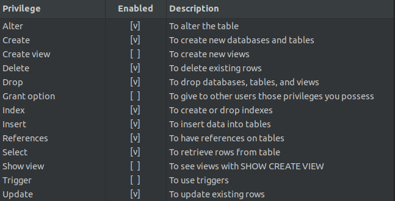

# PROMOTION

Esse é com toda certeza um dos projetos já feitos

---

## Como rodar o projeto

_Obs.: Fazer tudo em sequência para garantir que nenhum passo foi esquecido_

### Banco de dados

_Obs.: Tudo descrito abaixo deve ser feito na pasta **api**_

1. Criar database `promotion`

2. Criar usuário no banco de dados com:

   1. username: `developer`
   2. senha: `password`

3. Conceder as seguintes permissões (ou todas permissões) a esse usuário:
   

_Obs.: As permissões podem ser apenas na database do projeto ou em todas as databases_

### Backend

1. Instale o dotnet-ef usando o comando:

```bash
  dotnet tool install
```

2. Clonar o arquivo **`.env.example`** e renomear a cópia para **`.env`**
3. Inserir o valor das variáveis no arquivo **.env**
4. Rodar o comando:

```bash
dotnet ef database update
```

5. E por fim executar o projeto:

```bash
dotnet run
```

ou

```bash
dotnet watch run
```

### Frontend

_Obs.: Tudo descrito abaixo deve ser feito na pasta **frontend**_

1. Instalar as dependências do projeto usando o comando

```bash
npm i
```

2. Duplicar o arquivo **.env.example** e renomear a cópia para **.env.local**
3. Colocar os valores das variáveis no arquivo
4. Rodar o projeto usando o comando:

```bash
npm run dev
```

ou

```bash
yarn dev
```
